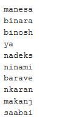
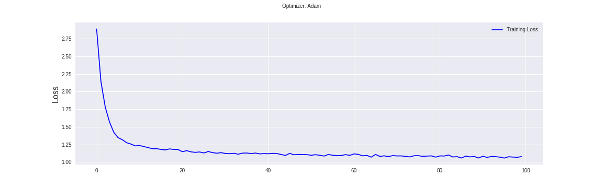
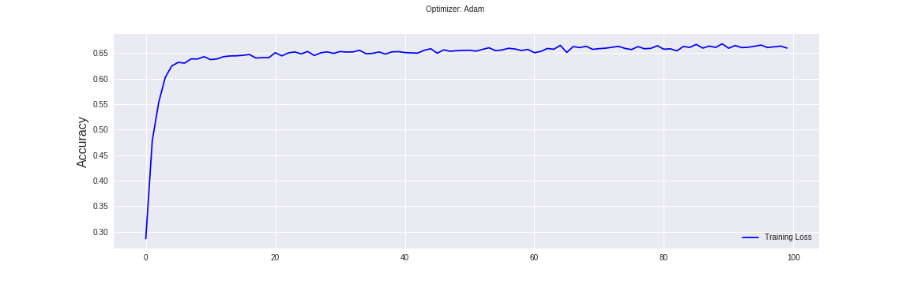
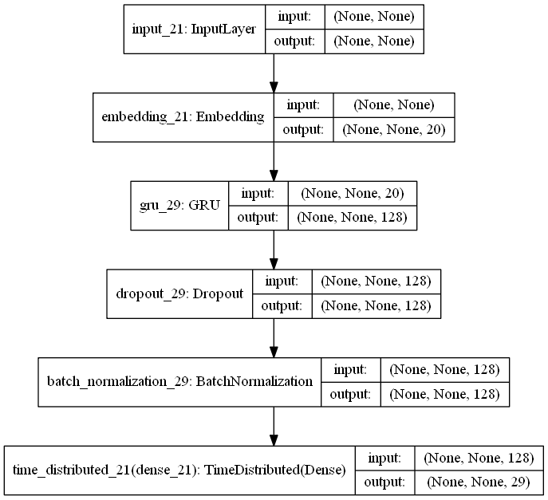

# Name Generation using GRU network
Indian name generation using Gated Recurrent units. It uses a character level language model for this task.

## Test Results

  
 

As you can see the model generates some names which doesn't sound quite indian, but with more data and training that problem can be solved.

## Training Plot

  Training loss 
  

  Training Accuracy 
  

## Model Architecture
It uses a unidirectional GRU network. 

  

