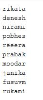

# Name Generation using GRU network
Indian name generation using Gated Recurrent units. It uses a character level language model for this task.

## Test Results

  
 

## Training Plot

  Training loss 
  

  Training Accuracy 
  

## Model Architecture
It uses a unidirectional GRU network. 

  

